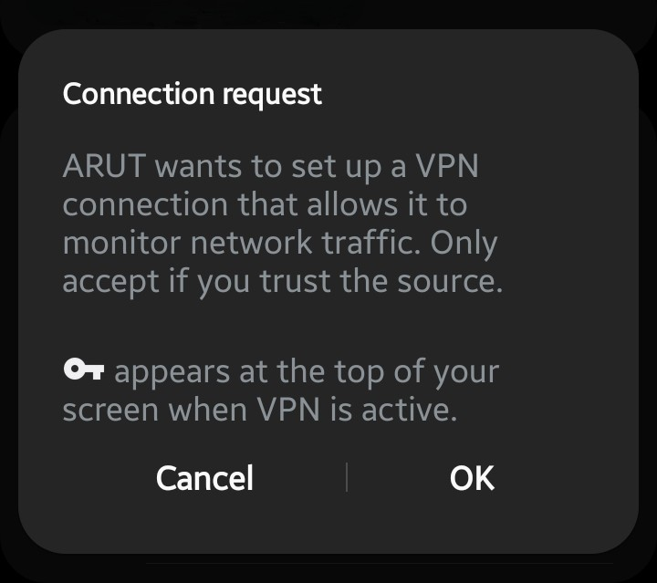
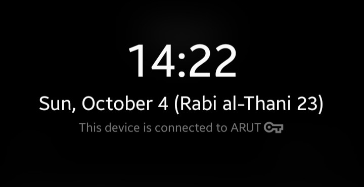

# ARUT

<h3 align="center"> Seamless, Rootless Android Reverse Tethering over USB</h3>

<p align="center">
Share your computer's internet connection with your Android device instantly over USB — fast, lightweight, and completely root-free.
</p>


## Overview

**ARUT** provides **reverse tethering** over `adb` for Android: it allows connected Android devices to access the internet connection of the computer they are plugged into.

- **No Root Required:** Operates entirely without root permissions (neither on the Android device nor on the host computer).
- **Cross-Platform:** Runs seamlessly on **GNU/Linux**, **Windows**, and **macOS**.
- **Supported Traffic:** Relays **TCP** and **UDP** traffic over **IPv4**.


## ⭐ Features

-  **High Performance:** Dual relay server backends available (**Rust** for ultra-low memory & CPU consumption, and **Java** for maximum portability).
-  **Local VPN-based Routing:** Intercepts traffic on-device using Android's native `VpnService` and forwards packets through ADB port reverse redirection.
-  **Multi-Device Support:** Manage single or multiple Android devices simultaneously with automatic tunnel management.
-  **Developer-Friendly:** Clean modular codebase split into Android client, Rust relay, and Java relay.


## 📂 Project Structure

```text
ARUT/
├── application/             # Android Client Application
│   ├── app/                 # Android app source code (VpnService)
│   ├── config/              # Checkstyle and signing configurations
│   ├── gradle/              # Gradle wrapper files
│   └── build.gradle         # Android Gradle build configuration
├── relay/                   # Host Relay Server Implementations
│   ├── java/                # Pure Java 17+ NIO asynchronous relay server
│   └── rust/                # High-performance Rust (mio) native relay server
├── dist/                    # Automated Multi-Platform Distribution Bundles
│   ├── windows/
│   │   ├── arut-rust-win64-v0.0.2-beta/      # Windows Native Rust package (arut.exe, ADB, APK, scripts)
│   │   └── arut-java-win64-v0.0.2-beta/      # Windows Java package (arut.jar, ADB, APK, scripts)
│   ├── linux/
│   │   ├── arut-rust-linux64-v0.0.2-beta/    # Linux Native Rust package (arut, ADB, APK, scripts)
│   │   └── arut-java-linux64-v0.0.2-beta/    # Linux Java package (arut.jar, ADB, APK, scripts)
│   ├── macos/
│   │   ├── arut-rust-macos64-v0.0.2-beta/    # macOS Native Rust package (arut, ADB, APK, scripts)
│   │   └── arut-java-macos64-v0.0.2-beta/    # macOS Java package (arut.jar, ADB, APK, scripts)
│   └── all-platform/
│       ├── arut-rust-all-v0.0.2-beta/        # Multi-Platform Rust bundle (arut.exe, arut, ADB, APK, scripts)
│       └── arut-java-all-v0.0.2-beta/        # Universal Java bundle (arut.jar, ADB, APK, scripts)
├── tools/                   # Bundled standalone platform tools
│   └── adb/                 # Official ADB binaries & runtime libraries
│       ├── windows/         # adb.exe, AdbWinApi.dll, AdbWinUsbApi.dll
│       ├── linux/           # adb binary & lib64/libc++.so
│       └── macos/           # adb binary & lib64/libc++.dylib
├── docs/                    # Architecture & Developer Documentation
│   ├── DEVELOPERS.md        # Technical developer guide & protocol specs
│   └── assets/              # Diagrams and screenshots
├── build-dist.cmd           # One-click Windows distribution builder & packager
├── build-dist.sh            # One-click Linux/macOS distribution builder & packager
└── README.md                # Project documentation
```


## ⚙️ Requirements & Prerequisites

### 1. Android Device
- Android 7.0+ (**API 24** or higher).
- **USB Debugging** enabled in *Developer Options* ([Official Guide][enable-adb]).

### 2. Host Computer

#### A. ADB (Android Debug Bridge) - Optional (Pre-bundled)
- Required for device tunneling (`adb reverse`).
- Pre-packaged standalone ADB tools are already bundled inside `tools/adb/` and each target folder in `dist/`.
- Alternatively, you can use your system-wide ADB package:
  - **Windows:** `winget install Google.PlatformTools`
  - **Linux (Ubuntu/Debian):** `sudo apt install adb` (or `sudo pacman -S android-tools` on Arch)
  - **macOS:** `brew install android-platform-tools`

#### B. Java (JDK / JRE) - Required for Android Client & Java Relay
- **Java (JDK / JRE)**:
  - **Linux (Ubuntu / Debian):**
    ```bash
    sudo apt update && sudo apt install default-jdk -y
    ```
  - **Linux (Fedora / RHEL):**
    ```bash
    sudo dnf install java-latest-openjdk-devel
    ```
  - **Linux (Arch Linux):**
    ```bash
    sudo pacman -S jdk-openjdk
    ```
  - **macOS:**
    ```bash
    brew install openjdk
    ```
  - **Windows:** Download from [Adoptium Temurin](https://adoptium.net/) or run:
    ```cmd
    winget install EclipseAdoptium.Temurin.17.JDK
    ```

#### C. Rust & Cargo (Required for High-Performance Native Relay)
- **Rust Toolchain** is required to compile native standalone binaries (`arut.exe` / `arut`):
  - **Windows:** Download and run the official installer from [rustup.rs](https://win.rustup.rs/x86_64) or run:
    ```cmd
    winget install Rustlang.Rustup
    ```
  - **Linux & macOS:** Run the official rustup script:
    ```bash
    curl --proto '=https' --tlsv1.2 -sSf https://sh.rustup.rs | sh
    ```
  - After installation, verify by checking `cargo --version` in a new terminal window.


## 🚀 Quick Start

### 1. Download Release
Download the [latest release][latest] in your preferred flavor:

#### Rust (Native - Lowest CPU & Memory, No Java Required)
- **Windows:** [`arut-rust-win64-v0.0.2-beta.zip`][direct-rust-win64]
- **Linux:** [`arut-rust-linux64-v0.0.2-beta.zip`][direct-rust-linux64]
- **macOS:** [`arut-rust-macos64-v0.0.2-beta.zip`][direct-rust-macos64]
- **All Platforms (Multi-Platform Rust):** [`arut-rust-all-v0.0.2-beta.zip`][direct-rust-all]

#### Java (Portable - Requires Java 17+)
- **Windows:** [`arut-java-win64-v0.0.2-beta.zip`][direct-java-win64]
- **Linux:** [`arut-java-linux64-v0.0.2-beta.zip`][direct-java-linux64]
- **macOS:** [`arut-java-macos64-v0.0.2-beta.zip`][direct-java-macos64]
- **All Platforms (Universal Java):** [`arut-java-all-v0.0.2-beta.zip`][direct-java-all]


### 2. How to Run Reverse Tethering

Connect your Android device to your computer via USB and ensure **USB Debugging** is turned ON in *Developer Options* ([Official Guide][enable-adb]).

---

#### Method A: 1-Click Launch (Recommended)

Each release folder includes pre-configured launcher scripts that automatically detect ADB, check/install `arut.apk`, configure the reverse tunnel, and start the relay server:

##### Windows (Rust & Java Flavors)
1. Extract your downloaded archive (e.g. `arut-rust-win64-v0.0.2-beta` or `arut-java-win64-v0.0.2-beta`).
2. Double-click **`arut-run.cmd`**.
   - **Why `arut-run.cmd` instead of `arut.exe`?** `arut.exe` is a command-line binary. Double-clicking `arut-run.cmd` automatically passes the `run` command and keeps the terminal window open with a pause, allowing you to monitor real-time traffic statistics and connection logs without the console window closing unexpectedly.

##### Linux (Rust & Java Flavors)
1. Extract your downloaded archive (e.g. `arut-rust-linux64-v0.0.2-beta` or `arut-java-linux64-v0.0.2-beta`).
2. Open a terminal inside the extracted directory and run:
   ```bash
   ./arut-run
   ```
   *(Or double-click `arut-run` if your desktop file manager is configured to execute shell scripts).*

##### macOS (Rust & Java Flavors)
1. Extract your downloaded archive (e.g. `arut-rust-macos64-v0.0.2-beta` or `arut-java-macos64-v0.0.2-beta`).
2. Open a terminal inside the extracted directory and run:
   ```bash
   ./arut-run
   ```

---

#### Method B: Terminal / Command-Line Interface (CLI Control)

If you prefer using the command prompt or terminal, navigate to your release folder and run the `arut` command directly:

##### On Windows (CMD / PowerShell):
```cmd
# Standard Run: Starts relay server and connects the attached Android device
arut run

# Auto-Run (Daemon Mode): Automatically connects any currently connected and future USB-attached devices
arut autorun

# Stop reverse tethering on the connected device
arut stop
```

##### On Linux & macOS (Bash / Zsh):
```bash
# Standard Run: Starts relay server and connects the attached Android device
./arut run

# Auto-Run (Daemon Mode): Automatically connects any currently connected and future USB-attached devices
./arut autorun

# Stop reverse tethering on the connected device
./arut stop
```

---

### Comparison: Rust vs. Java Flavors

| Feature | Rust Flavor (`arut-rust-...`) | Java Flavor (`arut-java-...`) |
| :--- | :--- | :--- |
| **Core Binary** | Native compiled executable (`arut.exe` on Windows, `arut` on Linux/macOS) | Java Bytecode Archive (`arut.jar`) |
| **Host Dependencies** | **None** (Zero external runtime dependencies required) | Requires **Java 17+** (JRE/JDK) installed |
| **Resource Usage** | Ultra-low memory footprint (~5 MB RAM) and minimal CPU | Lightweight asynchronous Java NIO engine |
| **Compatibility** | Architecture-native binaries (Win64, Linux64, macOS64) | Universal cross-platform bytecode |

---

### First-Time Connection on Android

When reverse tethering starts for the first time:
1. **VPN Permission Prompt:** Android will display a system dialog requesting permission to set up a VPN connection. Tap **OK** to authorize:

<p align="center">
  
</p>

2. **Active Status:** A VPN "key" icon will appear in the Android status bar. Your Android device is now browsing the internet through your computer's USB connection:

<p align="center">
  
</p>


## 📖 Usage & Commands

The `arut` CLI provides flexible commands to control the connection:

| Command | Description |
| :--- | :--- |
| `arut run` | Starts the relay and activates reverse tethering on a connected device (stops on Ctrl+C) |
| `arut autorun` | Automatically enables reverse tethering for all connected & future devices |
| `arut relay` | Starts only the relay server on the computer (listens on port 26074) |
| `arut install [serial]` | Installs `arut.apk` on the specified target device |
| `arut start [serial]` | Starts reverse tethering client on a device |
| `arut stop [serial]` | Stops reverse tethering client on a device |
| `arut tunnel [serial]` | Resets the ADB reverse tunnel |

> **Note:** The `[serial]` parameter is only required when multiple Android devices are connected.


## 🔧 Environment Variables

You can customize binary paths using environment variables:

```bash
# Custom ADB binary path
ADB=/path/to/custom/adb ./arut run

# Custom APK path
ARUT_APK=/path/to/custom/arut.apk ./arut run
```

---

## 🛠️ Building from Source

Once the prerequisites (**Java 17+** and optionally **Rust**) are installed:

### 1. Automatic Multi-Platform Packaging
Build and package all distributions into `dist/` with a single command:

- **On Windows:**
  Double-click `build-dist.cmd` (or run `.\build-dist.cmd` via terminal)
- **On Linux / macOS:**
  ```bash
  chmod +x build-dist.sh
  ./build-dist.sh
  ```

The resulting output packages will be cleanly organized under `dist/`:
- `dist/windows/` (Windows bundle with ADB and native/Java relay)
- `dist/linux/` (Linux bundle with ADB and native/Java relay)
- `dist/macos/` (macOS bundle with ADB and native/Java relay)
- `dist/all-platform/` (Universal Java bundle)

### 2. Manual Component Builds
- **Android Client APK:** `cd application && ./gradlew assembleRelease`
- **Java Relay Server:** `cd relay/java && ../../application/gradlew assembleRelease`
- **Rust Relay Server:** `cd relay/rust && cargo build --release`

---

## 🔬 Architecture & Developers

For comprehensive technical details regarding:
- Level 3 (IP) to Level 5 (TCP/UDP) protocol translation
- Asynchronous non-blocking I/O event loops (`Java NIO` & `Rust mio`)
- Buffer management and packet routing

Please consult the [Developers Guide](docs/DEVELOPERS.md).

---

> [!WARNING]
> There is always a possibility of error, so we assume no responsibility for any inaccuracies.

### <a name="Copyright©2026"></a> Copyright © 2026

Thank you for checking out ARUT. If you have any feedback or suggestions, feel free to contact us:
hamzabellouchcontact@gmail.com

Stay connected and follow us on:  
[WhatsApp](https://whatsapp.com/channel/0029Vb7MArw0LKZMpjjqOk2P) | [Facebook](https://facebook.com/hamzabellouch0) | [Instagram](https://instagram.com/hamzabellouch0) | [Twitter](https://twitter.com/hamzabellouch0) | [Telegram](https://t.me/hammzabellouch) | [LinkedIn](https://www.linkedin.com/in/hamzabellouch)


<!-- Links Reference List -->
[latest]: https://github.com/hamzabellouch/arut/releases/latest
[direct-rust-win64]: https://github.com/hamzabellouch/arut/releases/download/v0.0.2-beta/arut-rust-win64-v0.0.2-beta.zip
[direct-rust-linux64]: https://github.com/hamzabellouch/arut/releases/download/v0.0.2-beta/arut-rust-linux64-v0.0.2-beta.zip
[direct-rust-macos64]: https://github.com/hamzabellouch/arut/releases/download/v0.0.2-beta/arut-rust-macos64-v0.0.2-beta.zip
[direct-rust-all]: https://github.com/hamzabellouch/arut/releases/download/v0.0.2-beta/arut-rust-all-v0.0.2-beta.zip
[direct-java-win64]: https://github.com/hamzabellouch/arut/releases/download/v0.0.2-beta/arut-java-win64-v0.0.2-beta.zip
[direct-java-linux64]: https://github.com/hamzabellouch/arut/releases/download/v0.0.2-beta/arut-java-linux64-v0.0.2-beta.zip
[direct-java-macos64]: https://github.com/hamzabellouch/arut/releases/download/v0.0.2-beta/arut-java-macos64-v0.0.2-beta.zip
[direct-java-all]: https://github.com/hamzabellouch/arut/releases/download/v0.0.2-beta/arut-java-all-v0.0.2-beta.zip
[enable-adb]: https://developer.android.com/studio/command-line/adb.html#Enabling
[platform-tools]: https://developer.android.com/studio/releases/platform-tools.html
[platform-tools-windows]: https://dl.google.com/android/repository/platform-tools-latest-windows.zip
