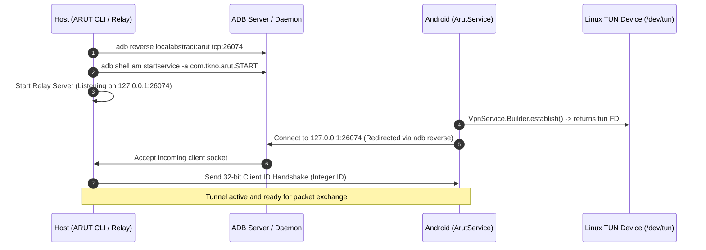
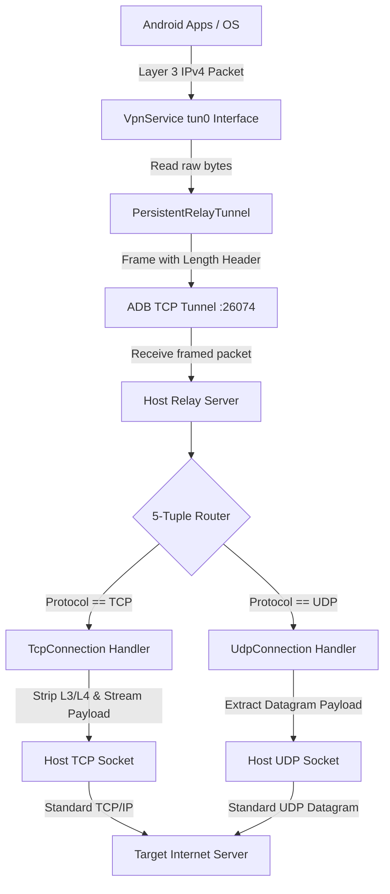
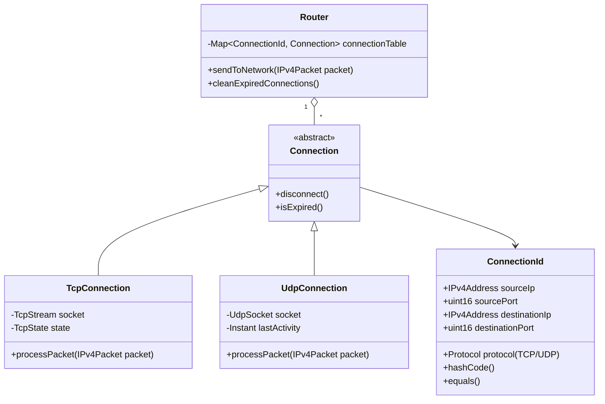

# ARUT Developer Guide & Architecture Specification

Welcome to the **ARUT** developer documentation. This guide provides an in-depth architectural breakdown, protocol specification, and code-level reference for software engineers and contributors working on the ARUT codebase.

## Table of Contents

1. [Architectural Overview](#architectural-overview)
2. [End-to-End Tunnel & Dataflow](#end-to-end-tunnel--dataflow)
3. [Protocol & Wire Format Specification](#protocol--wire-format-specification)
4. [Android Client Architecture](#android-client-architecture)
5. [Host Relay Server Architecture](#host-relay-server-architecture)
   - [Reactor Pattern & Asynchronous I/O](#1-reactor-pattern--asynchronous-io)
   - [Memory Model & Zero-Copy Packet Slicing](#2-memory-model--zero-copy-packet-slicing)
   - [5-Tuple Routing Table](#3-5-tuple-routing-table)
   - [TCP Connection Management & Flow Control](#4-tcp-connection-management--flow-control)
   - [UDP Datagram Lifecycle](#5-udp-datagram-lifecycle)
6. [Java Relay vs. Rust Relay Implementation](#java-relay-vs-rust-relay-implementation)
7. [Building from Source & Development Workflow](#building-from-source--development-workflow)
8. [Testing, Static Analysis & Code Quality](#testing-static-analysis--code-quality)
9. [Debugging & Traffic Tracing](#debugging--traffic-tracing)

## Architectural Overview

ARUT enables **rootless reverse tethering** over ADB (Android Debug Bridge) for Android devices, routing the device's internet traffic through the host computer.

```text
+-------------------------------------------------------------------------------+
|                               ANDROID DEVICE                                  |
|                                                                               |
|  +--------------------+         +-------------------+                         |
|  | User Applications  |         |   System Stack    |                         |
|  +---------+----------+         +---------+---------+                         |
|            |                              |                                   |
|            +--------------+---------------+                                   |
|                           | (Raw IPv4 Packets)                                |
|                           v                                                   |
|                +--------------------+                                         |
|                | Android VpnService |  (Intercepts all Layer 3 traffic)       |
|                +----------+---------+                                         |
|                           | (tun0 interface)                                  |
|                           v                                                   |
|                +--------------------+                                         |
|                |   ArutService      |  (Client daemon)                        |
|                +----------+---------+                                         |
|                           | (TCP tunnel over adb reverse)                     |
|                           v                                                   |
|                    127.0.0.1:26074                                            |
+---------------------------+---------------------------------------------------+
                            |
                     (USB / ADB Tunnel)
                            |
+---------------------------v---------------------------------------------------+
|                     127.0.0.1:26074                                           |
|                     HOST COMPUTER                                             |
|                                                                               |
|                +--------------------+                                         |
|                | ARUT Relay Server  |  (Rust mio / Java NIO Relay)            |
|                +----------+---------+                                         |
|                           |                                                   |
|            +--------------+--------------+                                    |
|            | (L3 <-> L5 Translation)     | (Datagram Forwarding)              |
|            v                             v                                    |
|   +-----------------+           +-----------------+                           |
|   | Standard TCP    |           | Standard UDP    |                           |
|   | Sockets (POSIX) |           | Sockets (POSIX) |                           |
|   +--------+--------+           +--------+--------+                           |
|            |                             |                                    |
|            +--------------+--------------+                                    |
|                           |                                                   |
|                           v                                                   |
|                +--------------------+                                         |
|                | Host Internet / WAN|                                         |
|                +--------------------+                                         |
+-------------------------------------------------------------------------------+
```

### Key Design Pillars
1. **Zero Root Privilege:** No root access required on either Android or host computer.
2. **Layer 3 to Layer 5 Translation:** The host relay operates as a lightweight User-Space NAT (Port-Restricted Cone NAT), converting raw IP packets from the Android device into standard unprivileged POSIX Berkeley sockets on the host.
3. **Lossless Backpressure (Flow Control):** The relay utilizes the TCP window mechanism to guarantee zero packet loss from network to device without maintaining redundant retransmission buffers.

## End-to-End Tunnel & Dataflow

### 1. Tunnel Initialization Sequence



### 2. Packet Processing Dataflow



## Protocol & Wire Format Specification

All communication between the Android client and the host relay server takes place over a dedicated, persistent TCP connection forwarded via `adb reverse localabstract:arut tcp:26074`.

### 1. Connection Handshake
Upon successful TCP connection establishment:
1. The relay server generates a unique **32-bit integer Client ID** (`uint32` in big-endian network byte order).
2. The relay writes this 4-byte identifier to the TCP stream.
3. The Android client reads the 4-byte ID. If the read completes successfully, the connection is validated and traffic routing begins.

### 2. Packet Framing Protocol
Because TCP is a continuous byte stream without native datagram boundaries, raw IPv4 packets are framed with a **2-byte length prefix**:

```text
+-----------------------+-----------------------------------------------+
|  Packet Length (2B)   |           Raw IPv4 Packet (N Bytes)           |
+-----------------------+-----------------------------------------------+
|  uint16 (Big-Endian)  |  IPv4 Header (20B+) | Transport Header | Data |
+-----------------------+-----------------------------------------------+
```

- **Packet Length Field:** 16-bit unsigned integer (`0x0014` to `0xFFFF`), representing the total size of the following IPv4 packet in bytes.
- **Maximum Transmission Unit (MTU):** Default is set to **4000 bytes** (`VpnConfiguration.DEFAULT_MTU`), well within the 65535-byte IPv4 limit.

### 3. Checksum Algorithm
When forging IP and TCP/UDP response packets to the Android client, standard 16-bit one's complement checksums are computed over:
- **IPv4 Header:** Computed over the 20+ byte IPv4 header fields.
- **UDP / TCP Header:** Computed over the transport header + payload + IPv4 pseudo-header (`Source IP`, `Destination IP`, `Zero`, `Protocol`, `TCP/UDP Length`).

## Android Client Architecture

The Android application source resides under [`application/app/src/main/java/com/tkno/arut/`](../application/app/src/main/java/com/tkno/arut/).

### Class Responsibilities

| Class | Source File | Purpose & Functionality |
| :--- | :--- | :--- |
| [`ArutService`](../application/app/src/main/java/com/tkno/arut/ArutService.java) | `ArutService.java` | Extends `android.net.VpnService`. Configures the virtual network interface (`tun0`), routes `0.0.0.0/0`, and manages service foreground lifecycle. |
| [`ArutActivity`](../application/app/src/main/java/com/tkno/arut/ArutActivity.java) | `ArutActivity.java` | Headless command receiver parsing Intent actions (`START`, `STOP`) sent via `adb shell am startservice`. |
| [`AuthorizationActivity`](../application/app/src/main/java/com/tkno/arut/AuthorizationActivity.java) | `AuthorizationActivity.java` | Handles Android's one-time system dialog requesting user VPN consent via `VpnService.prepare()`. |
| [`PersistentRelayTunnel`](../application/app/src/main/java/com/tkno/arut/PersistentRelayTunnel.java) | `PersistentRelayTunnel.java` | Resilient supervisor that manages `RelayTunnel` instances, handling automatic exponential backoff reconnection if the relay restarts. |
| [`RelayTunnel`](../application/app/src/main/java/com/tkno/arut/RelayTunnel.java) | `RelayTunnel.java` | Active worker thread managing bidirectional packet forwarding between the VPN `FileDescriptor` and the TCP tunnel socket. |
| [`IPPacketOutputStream`](../application/app/src/main/java/com/tkno/arut/IPPacketOutputStream.java) | `IPPacketOutputStream.java` | Parses incoming TCP byte stream, reconstructs complete IPv4 packets based on packet length headers, and writes discrete packets to `tun0`. |
| [`VpnConfiguration`](../application/app/src/main/java/com/tkno/arut/VpnConfiguration.java) | `VpnConfiguration.java` | Immutable data model holding VPN parameters (MTU: 4000, DNS addresses, session name). |

## Host Relay Server Architecture

The relay server acts as an unprivileged, user-space virtual router and NAT. It is implemented in two parallel implementations:
- **Java Relay:** [`relay/java/src/main/java/com/tkno/arut/`](../relay/java/src/main/java/com/tkno/arut/) (Java 17+ NIO)
- **Rust Relay:** [`relay/rust/src/relay/`](../relay/rust/src/relay/) (Rust 2021 `mio`)

### 1. Reactor Pattern & Asynchronous I/O

The server uses a **single-threaded Reactor Pattern** powered by non-blocking event demultiplexing (`java.nio.channels.Selector` in Java and `mio::Poll` in Rust).

```text
                         +-------------------+
                         | Event Loop (Poll) |
                         +---------+---------+
                                   |
         +-------------------------+-------------------------+
         |                         |                         |
         v                         v                         v
+-----------------+       +-----------------+       +-----------------+
|  Server Socket  |       | Client Tunnels  |       | Remote Sockets  |
| (Listening on   |       | (ADB streams    |       | (TCP & UDP      |
|  port 26074)    |       |  from devices)  |       |  to Internet)   |
+-----------------+       +-----------------+       +-----------------+
```

- **Zero Locking Overhead:** Because all socket channels, packet buffers, and routing state machines execute on a single event-loop thread, no mutexes, thread synchronization, or lock contention occur.
- **Massive Concurrency:** Hundreds of active TCP and UDP streams can be multiplexed simultaneously with minimal CPU utilization.

### 2. Memory Model & Zero-Copy Packet Slicing

To achieve maximum throughput:
- **Java Relay:** Employs direct `java.nio.ByteBuffer` slices. `IPv4Header`, `TCPHeader`, and `UDPHeader` point directly to offsets within the shared buffer without allocating intermediary byte arrays.
- **Rust Relay:** Utilizes Rust's ownership and lifetime system. `Ipv4Header<'a>` and `TransportHeader<'a>` are borrowed view structures pointing directly to the contiguous packet buffer memory (`&[u8]` and `&mut [u8]`), achieving true zero-allocation packet inspection.

### 3. 5-Tuple Routing Table

Each connected Android client maintains an isolated `Router` table. Outgoing packets are matched against a 5-tuple hash key (`ConnectionId`):

$$\text{ConnectionId} = \langle \text{Protocol}, \text{Source IP}, \text{Source Port}, \text{Destination IP}, \text{Destination Port} \rangle$$



### 4. TCP Connection Management & Flow Control

Managing user-space TCP connections without root privileges requires mimicking the TCP state machine while offloading reliability to the kernel:

#### The Lossless Backpressure Guarantee
- **Device-to-Network:** Any packet dropped by the relay is safely handled because the Android kernel's TCP stack will automatically retransmit it according to standard TCP congestion control.
- **Network-to-Device:** Once the host relay receives bytes from a remote internet TCP socket, it **must not drop them**.
- **Dynamic Interest Management (`interestOps` / `mio::Interest`):**
  - When the client's write buffer reaches capacity, the relay removes `OP_READ` (or `Readable` interest) from the remote TCP socket.
  - This halts reading from the remote socket at the OS socket buffer level, which triggers TCP Window scaling / zero-window probes to the remote server.
  - When the Android client drains the buffer, `OP_READ` is re-enabled, resuming download dataflow.

```text
[Remote Server] ---> (OS Socket Buffer) -X (Relay OP_READ disabled) ---> [Client Buffer Full]
                            ^
                            | (TCP Zero-Window / Backpressure pauses remote server)
```

### 5. UDP Datagram Lifecycle
- UDP is connectionless. Upon receiving the first UDP packet for a given `ConnectionId`, the relay instantiates a `UdpConnection`, binds a local UDP socket, and forwards datagram payloads.
- **Preserved Boundaries:** Datagram packet lengths are strictly preserved 1:1.
- **Garbage Collection:** The event selector runs an idle-cleanup check once every 60 seconds. Any UDP connection with no traffic for $> 2\text{ minutes}$ is pruned and its socket closed.

## Java Relay vs. Rust Relay Implementation

Both implementations share identical protocol rules, socket management semantics, and CLI interfaces.

| Metric / Dimension | Java Relay (`relay/java/`) | Rust Relay (`relay/rust/`) |
| :--- | :--- | :--- |
| **Language & Toolchain** | Java 17+ / Gradle 9 | Rust 2021 / Cargo (`mio 0.6`) |
| **Binary Output** | Portable `arut.jar` (JVM Bytecode) | Native standalone binary (`arut.exe`, `arut`) |
| **Runtime Dependency** | Requires JRE / JDK 17+ | **None** (Self-contained static binary) |
| **Idle Memory Footprint** | $\approx 35\text{ MB} - 55\text{ MB}$ (JVM overhead) | $\approx 4\text{ MB} - 6\text{ MB}$ RSS |
| **I/O Subsystem** | `java.nio.channels.Selector` | `mio::Poll` (epoll on Linux, kqueue on macOS, IOCP/wevent on Windows) |
| **Packet Memory Model** | Direct `ByteBuffer` views | Zero-copy lifetime-bound slices (`&'a [u8]`) |
| **Platform Target** | Universal (All OSes) | OS-Native (Windows x86_64, Linux x86_64, macOS x86_64/arm64) |

## Building from Source & Development Workflow

### 1. Workspace Prerequisites
- **JDK** (Default OpenJDK / JDK 17+)
- **Android SDK** with Platform Tools API 24+ & Build-Tools 36+
- **Rust Toolchain** (`rustup` / `cargo` 1.80+)

### 2. Standard Build Commands

#### Complete Multi-Platform Distribution Build
To compile the Android client APK, Java relay JAR, and Rust native binary, and package all versioned distribution bundles into `dist/`:

- **On Windows:**
  ```cmd
  build-dist.cmd
  ```
- **On Linux / macOS:**
  ```bash
  chmod +x build-dist.sh
  ./build-dist.sh
  ```

#### Component-Specific Compilation

- **Android Client APK (`application/`):**
  ```bash
  cd application
  ./gradlew assembleRelease
  ```
  *(Generates `application/app/build/outputs/apk/release/arut-release-unsigned.apk`)*

- **Java Relay Server (`relay/java/`):**
  ```bash
  cd relay/java
  ../../application/gradlew assembleRelease
  ```
  *(Generates `relay/java/build/libs/arut.jar`)*

- **Rust Native Relay Server (`relay/rust/`):**
  ```bash
  cd relay/rust
  cargo build --release
  ```
  *(Generates `relay/rust/target/release/arut` or `arut.exe`)*

## Testing, Static Analysis & Code Quality

### 1. Unit & Integration Testing

#### Java Test Suite
```bash
cd relay/java
../../application/gradlew test
```

#### Rust Test Suite
```bash
cd relay/rust
cargo test
```

### 2. Static Analysis & Linter Gates

#### Java Checkstyle Verification
```bash
cd relay/java
../../application/gradlew checkstyleMain checkstyleTest
```
*(Rules configured in `application/config/checkstyle/checkstyle.xml`)*

#### Rust Clippy & Formatting
```bash
cd relay/rust
cargo fmt --check
cargo clippy -- -D warnings
```

## Debugging & Traffic Tracing

### 1. Enabling Verbose Runtime Logs

- **Rust Relay Server:**
  ```bash
  # Windows CMD
  set RUST_LOG=trace
  arut run

  # Linux / macOS
  RUST_LOG=trace ./arut run
  ```

- **Java Relay Server:**
  Run with verbose JVM logging flags:
  ```bash
  java -Djava.util.logging.config.file=logging.properties -jar arut.jar run
  ```

### 2. Inspecting Device-Side Traffic with Wireshark

To capture and analyze packets passing through the ARUT reverse tethering tunnel:

1. **Log ADB Tunnel Traffic:**
   ```bash
   adb forward tcp:26074 tcp:26074
   ```
2. **Capture Android VPN Interface with `tcpdump` (if rooted/emulated):**
   ```bash
   adb shell tcpdump -i any -w /sdcard/arut_traffic.pcap
   adb pull /sdcard/arut_traffic.pcap .
   wireshark arut_traffic.pcap
   ```
3. **Verify Reverse Port Forwarding:**
   ```bash
   adb reverse --list
   ```
   *(Expected output: `localabstract:arut tcp:26074`)*
